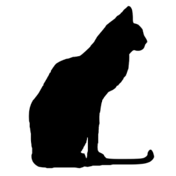
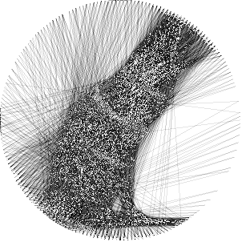

# string_art

This program tries to reproduce an image as accurately as possible using string art.

It uses only one thread, which makes the resulting sequence of nails easy to follow and reproduce manually.




## How to install

start by cloning the repository in your project's folder :
```bash
git clone "https://github.com/Erocr/string_art.git"
```

You can then use it in your python code :
```python
from string_art import ...
```

## Mini documentation

The main function is `string_art`. 
It takes:
- a PIL image, 
- a list of nail positions, 
- the width of the thread, 
It then computes a sequence of nails that produces a string-art representation of the input image.

If you want to quickly generate a set of evenly distributed nails, you can use `nails_circle_shape`, 
which creates nail positions arranged in a circle.

## Example

```python
from string_art import string_art, nails_circle_shape
from PIL import Image


image = Image.open("your_image.png")

image_size = (image.width, image.height)
number_of_nails = 50
nails = nails_circle_shape(image_size, number_of_nails)

im, nails, t = string_art(image, nails)

print(f"It took {t} seconds")
print(f"The sequence of nails found is : \n{nails}")
im.show()
im.save("output.png")
```

## How it works

It uses a greedy algorithm. 
It choses iteratively the next nail that minimizes the overall error. 
It stops when the best nail increases the error.

